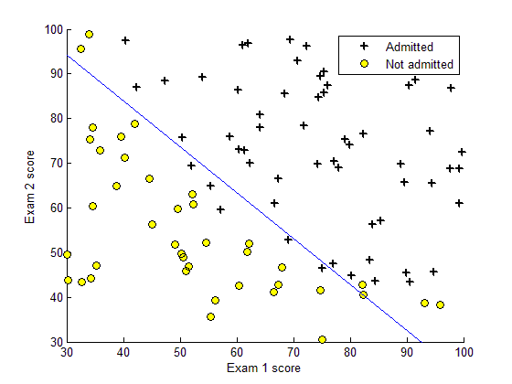
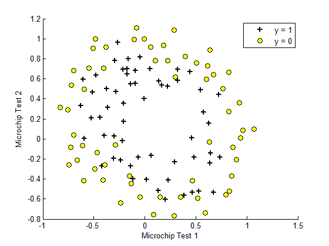
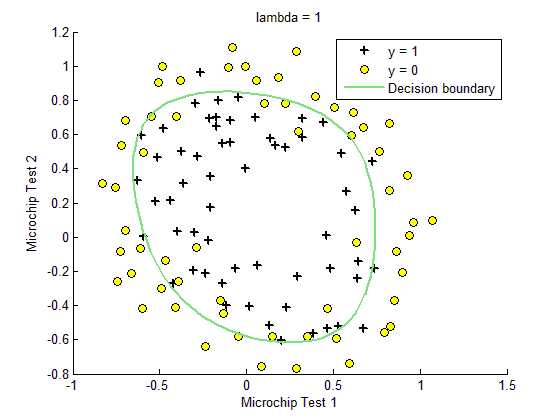
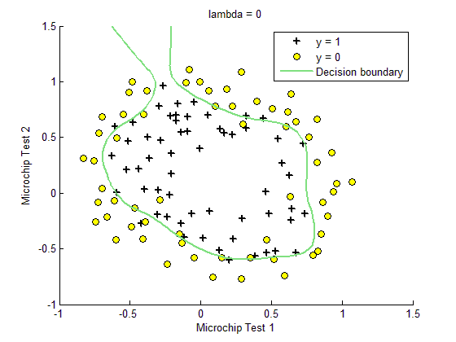
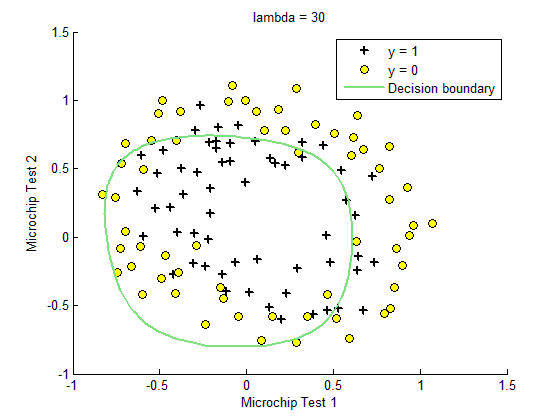

#  题目： 逻辑回归解题报告

本次作业为 `机器学习` 课程的第二次作业主要是和逻辑回归算法相关的课设和结题报告。

## 实现功能简介

针对作业中提供的训练集 `ex2data1.txt` 和 `ex2data2.txt` ，将分类任务转换为回归模型，绘制散点、求代价、梯度和决策边界，并且以此进行预测。

## 编写代码详述

在讨论具体的编码实现之中，我们可以对我们的程序文件进行逐个分析并简述功能和结果。在本部分之中我们会逐步分析 `ex2.m` 和 `ex2reg.m` 两个文件中的各个 Part 去逐渐的完成这几个 Task 的功能，最终达到完成本次题目并且最终了解与逻辑回归相关知识的目的。

### Logistic Regression

在 `ex2.m` 之中我们在 Part 1 之前，先行载入了对应的训练集，再对数据进行相应的处理。

#### 分析训练集

``` matlab
%% Load Data
%  The first two columns contains the exam scores and the third column
%  contains the label.

data = load('ex2data1.txt');
X = data(:, [1, 2]); y = data(:, 3);
```

我们载入了 `ex2data1.txt ` 中的数据，其中的数据大概是如下的样式：

``` java
34.62365962451697,78.0246928153624,0
30.28671076822607,43.89499752400101,0
35.84740876993872,72.90219802708364,0
60.18259938620976,86.30855209546826,1
```

根据注释我们可以知道，这里面第一列是 **em1** 的成绩，第二列是 **em2** 的成绩，第三列的 **label** 使用数字代替布尔值，代表是否通过。

#### 散点图绘制

**Part 1 Plotting**  要求我们把给出的训练集以散点图的方式绘制出来：

``` matlab
%% ==================== Part 1: Plotting ====================
%  We start the exercise by first plotting the data to understand the 
%  the problem we are working with.

fprintf(['Plotting data with + indicating (y = 1) examples and o ' ...
         'indicating (y = 0) examples.\n']);
plotData(X, y);
... 
pause;
```

和上次的题目一样我们要去实现这个进行绘制的方法 `plotData` 这个方法。

根据 Part 中的注释可知我们需要把 **y = 1** 的地方画上加号$+$ ，在所有的 **y=0** 的地方画上圈圈 $O$ ，因此我们可以使用多种方式去实现这个过程，这里我们试着用 `find` 方法去解决：

```matlab
pos = find(y == 1); 
neg = find(y == 0); 
plot(X(pos, 1), X(pos, 2), 'k+','LineWidth', 2, ...
'MarkerSize', 7);
plot(X(neg, 1), X(neg, 2), 'ko', 'MarkerFaceColor', 'y', ...
'MarkerSize', 7);
```

这里我们根据提示，使用 find 方法返回了所有 **y == 1** 和 **y ==0 ** 的迭代器下标，将迭代器传入 plot 函数进行绘制，这样的数据处理之后都是已经正确向量化的，最后我们可以获得正确的图形：


最后全部实现的 `plotData` 中的代码如下：

``` matlab
function plotData(X, y)
%PLOTDATA Plots the data points X and y into a new figure 
%   PLOTDATA(x,y) plots the data points with + for the positive examples
%   and o for the negative examples. X is assumed to be a Mx2 matrix.
% Create New Figure
figure; hold on;
pos = find(y==1); 
neg = find(y == 0); 
plot(X(pos, 1), X(pos, 2), 'k+','LineWidth', 2, ...
'MarkerSize', 7);
plot(X(neg, 1), X(neg, 2), 'ko', 'MarkerFaceColor', 'y', ...
'MarkerSize', 7);
hold off;
end
```

#### 代价和梯度

**Part 2 Compute Cost and Gradient** 中提示我们要计算 `逻辑回归` 的代价和梯度，在 `costFunction.m` 中的相应实现方法：

``` matlab
%% ============ Part 2: Compute Cost and Gradient ============
%  In this part of the exercise, you will implement the cost and gradient
%  for logistic regression. You neeed to complete the code in 
%  costFunction.m
%  Setup the data matrix appropriately, and add ones for the intercept term
[m, n] = size(X);
% Add intercept term to x and X_test
X = [ones(m, 1) X];
% Initialize fitting parameters
initial_theta = zeros(n + 1, 1);
% Compute and display initial cost and gradient
[cost, grad] = costFunction(initial_theta, X, y);

```

根据分析和上面代码中注释的提示，我们能知道我们在程序中使用 $X$ 是个矩阵，它的列表示一个特征，行向量表示一个实例。$theta$ 是 $n+1$ 个元素的列向量，$y$ 是 $m$ 个元素的结果向量。

使用的这些参数的布局我绘制了一张示意图：


##### 求代价

我们知道计算代价的 **代价计算公式** 为 ：

$$
J(\theta) = – \frac{1}{m} \sum_{i = 1}^{m} \left( y^{(i)} log(h(x^{(i)})) + (1-y^{(i)}) log\left(1-h(x^{(i)})\right) \right)
$$

这个代价计算公式看起来和上一次作业中的公式非常的相似，唯一的区别是 $h(x)$ 的计算方式改成了使用逻辑公式的计算。代价计算公式中出现过很多次 $h(x)$ 在实际计算的过程中我们可以事先计算 $h(x)$ 的值：

$$
h(x) = \frac{1}{1 + e^{- \theta^T x}} 
$$

我们可以将程序写作：

```matlab
hx = sigmoid(X * theta);
```

计算这个公式我们需要去实现对应的逻辑函数的程序实现：

> **逻辑函数**或**逻辑曲线**是一种常见的 S函数sigmoid function，它是皮埃尔·弗朗索瓦·韦吕勒在1844或1845年在研究它与人口增长的关系时命名的。广义Logistic曲线可以模仿一些情况人口增长（*P*）的S形曲线。起初阶段大致是指数增长然后随着开始变得饱和，增加变慢；最后，达到成熟时增加停止。
>
> 一个简单的Logistic函数可用下式表示：
>
> $$ P(t) = \frac{1}{1 + e^{-t}} $$

因此我们需要去实现 `sigmoid.m` 中的对应的函数实现：

``` matlab
g = 1 ./ (1 + exp(-z));
```

最后 `sigmoid.m` 的全部代码实现为：

``` matlab
function g = sigmoid(z)
%SIGMOID Compute sigmoid functoon
%   J = SIGMOID(z) computes the sigmoid of z.
% You need to return the following variables correctly 
g = zeros(size(z));
% ====================== YOUR CODE HERE ======================
% Instructions: Compute the sigmoid of each value of z (z can be a matrix,
%               vector or scalar).
g = 1 ./ (1 + exp(-z));
end
```

我们接着来求这个代价计算公式，我们求和号中的每一项对应着数据集中的一行，可以通过 `向量化` 的方法去实现这个过程：

``` matlab
J = (-1/m) * sum(y .* log(hx) + (1-y) .* log(1 - hx));
```

##### 求梯度

根据上面的代价计算公式求 $\theta$ 的偏微分，我们知道求梯度的 **梯度计算公式** 为：

$$
\frac{\partial}{\partial \theta_j} J(\theta) = \frac{1}{m} \sum_{i=1}^{m}\left( \left(h(x^{(i)}) – y^{(i)}\right) x_j^{(i)} \right)
$$

这部分的代码实现就相对简单了很多：

``` matlab
grad = 1 / m * X' * (sigmoid(X * theta) - y);
```

最终全部的实现代码：

``` matlab
function [J, grad] = costFunction(theta, X, y)
%COSTFUNCTION Compute cost and gradient for logistic regression
%   J = COSTFUNCTION(theta, X, y) computes the cost of using theta as the
%   parameter for logistic regression and the gradient of the cost
%   w.r.t. to the parameters.
% Initialize some useful values
m = length(y); % number of training examples
% You need to return the following variables correctly 
J = 0;
grad = zeros(size(theta));
hx = sigmoid(X * theta);
J =- 1 / m * sum(y .* log(hx) + (1 - y) .* log(1 - hx));
grad = 1 / m * X' * (sigmoid(X * theta) - y);
% =============================================================
end
```

#### 决策边界 

根据 **Part 3: Optimizing using fminunc** 的要求和代码的提示：

``` matlab
%% ============= Part 3: Optimizing using fminunc  =============
%  In this exercise, you will use a built-in function (fminunc) to find the
%  optimal parameters theta.
%  Set options for fminunc
options = optimset('GradObj', 'on', 'MaxIter', 400);
 %  Run fminunc to obtain the optimal theta
 %  This function will return theta and the cost 
[theta, cost] = fminunc(@(t)(costFunction(t, X, y)), initial_theta, options);
 % Plot Boundary
plotDecisionBoundary(theta, X, y);
```

我们分析上面的代码，`@(t)(costFunction(t, X, y)) ` 是为了把函数 costFunction 转换为只接受一个参数 t 的函数，之后我们调用了 `plotDecisionBoundary` 画出点和决策边界。

在这之前我们在 **散点图绘制** 中得到的结果，我们可以发现这其中的数据有明显的分界线，并且通过 costFunction 计算出在 $\theta = 0$ 时，初始的距离与其的偏微分。将其导入最小化函数中，得到相应的 $\theta$ 与其的偏微分，就可以绘制出一条所有样本到其的欧氏距离之和最小的直线，这就是我们画出的这条决策边界。



#### 预测

``` matlab
%% ============== Part 4: Predict and Accuracies ==============
%  After learning the parameters, you'll like to use it to predict the outcomes
%  on unseen data. In this part, you will use the logistic regression model
%  to predict the probability that a student with score 20 on exam 1 and 
%  score 80 on exam 2 will be admitted.
%  Furthermore, you will compute the training and test set accuracies of 
%  our model.
%  Your task is to complete the code in predict.m
%  Predict probability for a student with score 45 on exam 1 
%  and score 85 on exam 2 
```

在从 **Part 3** 中获取到参数之后，我们就可以进行相关的预测和分析了，$ \theta ^Tx >0 $ 的时候，$h(x) > 0.5$   应该预测结果为 1 ，当 $ \theta ^Tx <0 $ 时，$h(x) < 0.5$ 应该预测结果为 0。

因此我们在 `predict.m` 中的实现代码为：

``` matlab
function p = predict(theta, X)
%PREDICT Predict whether the label is 0 or 1 using learned logistic 
%regression parameters theta
%   p = PREDICT(theta, X) computes the predictions for X using a 
%   threshold at 0.5 (i.e., if sigmoid(theta'*x) >= 0.5, predict 1)
m = size(X, 1); % Number of training examples
% You need to return the following variables correctly
p = zeros(m, 1);
p(sigmoid(X*theta)>0.5)=1; 
end
```

这里我们按照程序中的提示传入 45 和 85 的成绩，输出的结果为：

``` matlab
Plotting data with + indicating (y = 1) examples and o indicating (y = 0) examples.
Program paused. Press enter to continue.
Cost at initial theta (zeros): 0.693147
Gradient at initial theta (zeros): 
 -0.100000 
 -12.009217 
 -11.262842 
Program paused. Press enter to continue.
Local minimum possible.
fminunc stopped because the final change in function value relative to 
its initial value is less than the default value of the function tolerance.
<stopping criteria details>
Cost at theta found by fminunc: 0.203506
theta: 
 -24.932920 
 0.204407 
 0.199617 
Program paused. Press enter to continue.
For a student with scores 45 and 85, we predict an admission probability of 0.774323
Train Accuracy: 89.000000
Program paused. Press enter to continue.
```

### Polynomial regression + regularizition

#### 绘制散点图

我们之前已经实现过 `plotData()` 这个方法，所以我们直接就可以调用绘制：

``` matlab
data = load('ex2data2.txt');
X = data(:, [1, 2]); y = data(:, 3);
plotData(X, y);
% Put some labels 
hold on;
% Labels and Legend
xlabel('Microchip Test 1')
ylabel('Microchip Test 2')
% Specified in plot order
legend('y = 1', 'y = 0')
hold off;
```

绘制出的 **散点图** 如下：



根据注释提示和从图中观察，我们发现我们这次的数据和上面不一样，并不是线性的，我们需要根据公示去构建非线性的分类。

#### 代价和梯度

``` matlab
%% =========== Part 1: Regularized Logistic Regression ============
%  In this part, you are given a dataset with data points that are not
%  linearly separable. However, you would still like to use logistic 
%  regression to classify the data points. 
%  To do so, you introduce more features to use -- in particular, you add
%  polynomial features to our data matrix (similar to polynomial
%  regression).
% Add Polynomial Features
% Note that mapFeature also adds a column of ones for us, so the intercept
% term is handled
X = mapFeature(X(:,1), X(:,2));
```

`mapFeature` 这个方法本身也已经被实现了，我们使用已有的特征的幂来当做新的特征，这里最高6次幂：

``` matlab
function out = mapFeature(X1, X2)
degree = 6;
out = ones(size(X1(:,1)));
for i = 1:degree
    for j = 0:i
        out(:, end+1) = (X1.^(i-j)).*(X2.^j);
    end
end
end
```

我们在非线性的条件下使用的非线性 **代价计算公式**：

$$
J(\theta) = – \left[ \frac{1}{m} \sum_{i = 1}^{m} \left( y^{(i)} log(h(x^{(i)})) + (1-y^{(i)}) log\left(1-h(x^{(i)})\right) \right) \right] + \frac{\lambda}{2m} \sum_{j=1}^{n} \theta_j^2
$$

非线性的代价计算公式我们增加了一个新的项目 $(\frac{\lambda}{2m} \sum_{j=1}^{n} \theta_j^2)$ ，$\theta_0$ 和之前相同。

具体的实现代码如下：

``` matlab
hx = sigmoid(X * theta);
J = (-1/m) * sum(y .* log(hx) + (1-y) .* log(1 - hx)) + (lambda/(2*m)) * (sum(theta .* theta) - theta(1)^2);
```

这里面我们要记得减去 $\theta_1$ 的平方，因为本身代码中不包含 $\theta_0$ 。

我们根据非线性的代价公式的偏微分，推导出我们使用的 **梯度计算公式** :

$$
\frac{\partial}{\partial \theta_0} J(\theta) = \frac{1}{m} \sum_{i=1}^{m} \left(h(x^{(i)}) – y^{(i)}\right) x_0^{(i)}
$$

$$
\frac{\partial}{\partial \theta_j} J(\theta) = \left( \frac{1}{m} \sum_{i=1}^{m} \left(h(x^{(i)}) – y^{(i)}\right) x_j^{(i)} \right) + \frac{\lambda}{m}\theta_j
$$

``` matlab
grad(1,1) = (1 / m *(predictions - y)' * X(:,1));
grad(2:n, 1) = (1 / m * (predictions - y)' * X(:,2:n) )'+ 1 / m * lambda * theta(2:n,1);
```

最后我们得到的全部的代价和梯度的代码为：

``` matlab
function [J, grad] = costFunctionReg(theta, X, y, lambda)
%COSTFUNCTIONREG Compute cost and gradient for logistic regression with regularization
%   J = COSTFUNCTIONREG(theta, X, y, lambda) computes the cost of using
%   theta as the parameter for regularized logistic regression and the
%   gradient of the cost w.r.t. to the parameters. 
% Initialize some useful values
m = length(y); % number of training examples
J = 0;
grad = zeros(size(theta));
hx = sigmoid(X * theta);         % m x 1 predictions of hypothesis on all m examples
J = 1 / m * (-y'*log(hx) - (1 - y)' * log(1 - hx)) + 1 / (2 * m) * lambda * (theta' * theta - (theta(1, 1))^2);   % cost function
n = size(theta);
grad(1,1) = (1 / m *(predictions - y)' * X(:,1));
grad(2:n, 1) = (1 / m * (predictions - y)' * X(:,2:n) )'+ 1 / m * lambda * theta(2:n,1);%+ 
end
```

#### 决策边界

这部分决策边界的绘制程序也已经实现了：

``` matlab
else
    % Here is the grid range
    u = linspace(-1, 1.5, 50);
    v = linspace(-1, 1.5, 50);
    z = zeros(length(u), length(v));
    % Evaluate z = theta*x over the grid
    for i = 1:length(u)
        for j = 1:length(v)
            z(i,j) = mapFeature(u(i), v(j))*theta;
        end
    end
    z = z'; % important to transpose z before calling contour
    % Plot z = 0
    % Notice you need to specify the range [0, 0]
    contour(u, v, z, [0, 0], 'LineWidth', 2)
end
```

绘制出非线性的决策边界的图：



输出的结果如下，$\theta = 0.6931$ 准确率为：$83.05\%$ 

``` matlab
Cost at initial theta (zeros): 0.693147
Program paused. Press enter to continue.
Local minimum possible.
fminunc stopped because the final change in function value relative to 
its initial value is less than the default value of the function tolerance.
<stopping criteria details>
Train Accuracy: 83.050847
```

完成了 $\lambda = 1$ 的情况，我们还要针对不同的数据去进行测试，这里我们选择了 0 和 30 作为参考量进行分析。



$\lambda = 0$ 情况下的程序输出为：

``` matlab
Cost at initial theta (zeros): 0.693147
Program paused. Press enter to continue.
Solver stopped prematurely.
fminunc stopped because it exceeded the iteration limit,
options.MaxIter = 400 (the selected value).
Train Accuracy: 87.288136
```



$\lambda = 30 $ 情况下的程序输出为：

``` matlab
Cost at initial theta (zeros): 0.693147
Program paused. Press enter to continue.
Local minimum possible.
fminunc stopped because the final change in function value relative to 
its initial value is less than the default value of the function tolerance.
<stopping criteria details>
Train Accuracy: 67.796610
```

根据分析结果，当 $\lambda = 0$ 决策边界变得特别复杂，但是拟合率也相应的上升了，上升到了$87\%$ 以上，但是本身也出现了一些过度拟合的问题。但是当 $\lambda=30$ 曲线虽然变的更为平滑，但是你和率下降到了 $67\%$ 决策边界不能很好地反应数据。

## 总结

本次作业中我主要接触了逻辑分析和代价计算、梯度下降、求决策边界等方面的具体知识。相比于上一次作业中的我们进行的一些尝试（只能说是浅尝辄止），这次我们进行了一些更多、更为深入的了解和学习。我个人比较感兴趣的方向是和 PLT 相关的方向，多是和编程语言的发展、设计、证明相关的知识，平时在这方面的实践仅限于一些编译器、解释器的构造。在 Machine Learning 方向上的尝试和实践让我有了很多的长进，无论是在知识方面的，还是在对一些工具方面的使用上的。

机器学习在这些年的不断发展让这个学科和领域让这个学科备受瞩目，基于学习的程序和设计实现为我们提供了一种新的思路和方式去理解现在的生物甚至是人。比如最近我们将机器学习运用在了围棋 AI 上面了，在去年击败李世石之后今年又击败了现在的世界第一柯洁。这种 AI 的学习和设计方式是以往 AI 使用自动机方式设计的一个很大的长进。

我自己在课后也对 Machine Learning 这方面进行了一些新的实践，我在 Github 中找到了一些通过训练集训练 AI 的程序仓库，通过训练 AI 去完成一些简单的小游戏。这些仓库通过一些可视化的方式让我们意识到了我们在实现的哪一个个算法到底能让我们的程序和生活产生哪些进步和发展，我们仍然活在一个不断地发展和进步的时代不是么？不断进步和发展在计算机行业仍然是能清晰可见的，感谢这个发现的年代和有趣的课程。