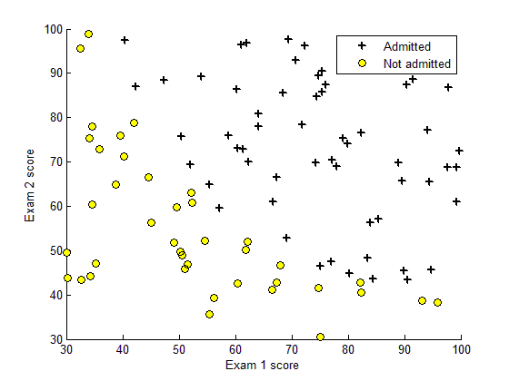
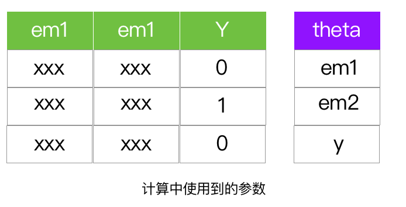

#  题目： 逻辑回归解题报告

本次作业为 `机器学习` 课程的第二次作业主要是和逻辑回归算法相关的课设和结题报告。

## 实现功能简介


## 编写代码详述

在讨论具体的编码实现之中，我们可以对我们的程序文件进行逐个分析并简述功能和结果。在本部分之中我们会逐步分析 `ex2.m` 和 `ex2reg.m` 两个文件中的各个 Part 去逐渐的完成这几个 Task 的功能，最终达到完成本次题目并且最终了解与逻辑回归相关知识的目的。

### Logistic Regression

在 `ex2.m` 之中我们在 Part 1 之前，先行载入了对应的训练集，再对数据进行相应的处理。

#### 分析训练集

``` matlab
%% Load Data
%  The first two columns contains the exam scores and the third column
%  contains the label.

data = load('ex2data1.txt');
X = data(:, [1, 2]); y = data(:, 3);
```

我们载入了 `ex2data1.txt ` 中的数据，其中的数据大概是如下的样式：

``` java
34.62365962451697,78.0246928153624,0
30.28671076822607,43.89499752400101,0
35.84740876993872,72.90219802708364,0
60.18259938620976,86.30855209546826,1
```

根据注释我们可以知道，这里面第一列是 **em1** 的成绩，第二列是 **em2** 的成绩，第三列的 **label** 使用数字代替布尔值，代表是否通过。

#### 散点图绘制

**Part 1 Plotting**  要求我们把给出的训练集以散点图的方式绘制出来：

``` matlab
%% ==================== Part 1: Plotting ====================
%  We start the exercise by first plotting the data to understand the 
%  the problem we are working with.

fprintf(['Plotting data with + indicating (y = 1) examples and o ' ...
         'indicating (y = 0) examples.\n']);
plotData(X, y);
... 
pause;
```

和上次的题目一样我们要去实现这个进行绘制的方法 `plotData` 这个方法。

根据 Part 中的注释可知我们需要把 **y = 1** 的地方画上加号$+$ ，在所有的 **y=0** 的地方画上圈圈 $O$ ，因此我们可以使用多种方式去实现这个过程，这里我们试着用 `find` 方法去解决：

```matlab
pos = find(y == 1); 
neg = find(y == 0); 
plot(X(pos, 1), X(pos, 2), 'k+','LineWidth', 2, ...
'MarkerSize', 7);
plot(X(neg, 1), X(neg, 2), 'ko', 'MarkerFaceColor', 'y', ...
'MarkerSize', 7);
```

这里我们根据提示，使用 find 方法返回了所有 **y == 1** 和 **y ==0 ** 的迭代器下标，将迭代器传入 plot 函数进行绘制，这样的数据处理之后都是已经正确向量化的，最后我们可以获得正确的图形：



最后全部实现的 `plotData` 中的代码如下：

``` matlab
function plotData(X, y)
%PLOTDATA Plots the data points X and y into a new figure 
%   PLOTDATA(x,y) plots the data points with + for the positive examples
%   and o for the negative examples. X is assumed to be a Mx2 matrix.
% Create New Figure
figure; hold on;
pos = find(y==1); 
neg = find(y == 0); 
plot(X(pos, 1), X(pos, 2), 'k+','LineWidth', 2, ...
'MarkerSize', 7);
plot(X(neg, 1), X(neg, 2), 'ko', 'MarkerFaceColor', 'y', ...
'MarkerSize', 7);
hold off;
end
```

#### 代价和梯度

**Part 2 Compute Cost and Gradient** 中提示我们要计算 `逻辑回归` 的代价和梯度，在 `costFunction.m` 中的相应实现方法：

``` matlab
%% ============ Part 2: Compute Cost and Gradient ============
%  In this part of the exercise, you will implement the cost and gradient
%  for logistic regression. You neeed to complete the code in 
%  costFunction.m
%  Setup the data matrix appropriately, and add ones for the intercept term
[m, n] = size(X);
% Add intercept term to x and X_test
X = [ones(m, 1) X];
% Initialize fitting parameters
initial_theta = zeros(n + 1, 1);
% Compute and display initial cost and gradient
[cost, grad] = costFunction(initial_theta, X, y);

```

根据分析和上面代码中注释的提示，我们能知道我们在程序中使用 $X$ 是个矩阵，它的列表示一个特征，行向量表示一个实例。$theta$ 是 $n+1$ 个元素的列向量，$y$ 是 $m$ 个元素的结果向量。

使用的这些参数的布局我绘制了一张示意图：



##### 求代价

我们知道计算代价的 **代价计算公式** 为 ：

$$
J(\theta) = – \frac{1}{m} \sum_{i = 1}^{m} \left( y^{(i)} log(h(x^{(i)})) + (1-y^{(i)}) log\left(1-h(x^{(i)})\right) \right)
$$

这个代价计算公式看起来和上一次作业中的公式非常的相似，唯一的区别是 $h(x)$ 的计算方式改成了使用逻辑公式的计算。代价计算公式中出现过很多次 $h(x)$ 在实际计算的过程中我们可以事先计算 $h(x)$ 的值：

$$
h(x) = \frac{1}{1 + e^{- \theta^T x}} 
$$

我们可以将程序写作：

```matlab
hx = sigmoid(X * theta);
```

计算这个公式我们需要去实现对应的逻辑函数的程序实现：

> **逻辑函数**或**逻辑曲线**是一种常见的 S函数sigmoid function，它是皮埃尔·弗朗索瓦·韦吕勒在1844或1845年在研究它与人口增长的关系时命名的。广义Logistic曲线可以模仿一些情况人口增长（*P*）的S形曲线。起初阶段大致是指数增长然后随着开始变得饱和，增加变慢；最后，达到成熟时增加停止。
>
> 一个简单的Logistic函数可用下式表示：
>
> $$ P(t) = \frac{1}{1 + e^{-t}} $$

因此我们需要去实现 `sigmoid.m` 中的对应的函数实现：

``` matlab
g = 1 ./ (1 + exp(-z));
```

最后 `sigmoid.m` 的全部代码实现为：

``` matlab
function g = sigmoid(z)
%SIGMOID Compute sigmoid functoon
%   J = SIGMOID(z) computes the sigmoid of z.
% You need to return the following variables correctly 
g = zeros(size(z));
% ====================== YOUR CODE HERE ======================
% Instructions: Compute the sigmoid of each value of z (z can be a matrix,
%               vector or scalar).
g = 1 ./ (1 + exp(-z));
end
```

我们接着来求这个代价计算公式，我们求和号中的每一项对应着数据集中的一行，可以通过 `向量化` 的方法去实现这个过程：

``` matlab
J = (-1/m) * sum(y .* log(hx) + (1-y) .* log(1 - hx));
```

##### 求梯度

根据上面的代价计算公式求 $\theta$ 的偏微分，我们知道求梯度的 **梯度计算公式** 为：

$$
\frac{\partial}{\partial \theta_j} J(\theta) = \frac{1}{m} \sum_{i=1}^{m}\left( \left(h(x^{(i)}) – y^{(i)}\right) x_j^{(i)} \right)
$$

这部分的代码实现就相对简单了很多：

``` matlab
grad = 1 / m * X' * (sigmoid(X * theta) - y);
```

最终全部的实现代码：

``` matlab
function [J, grad] = costFunction(theta, X, y)
%COSTFUNCTION Compute cost and gradient for logistic regression
%   J = COSTFUNCTION(theta, X, y) computes the cost of using theta as the
%   parameter for logistic regression and the gradient of the cost
%   w.r.t. to the parameters.
% Initialize some useful values
m = length(y); % number of training examples
% You need to return the following variables correctly 
J = 0;
grad = zeros(size(theta));
hx = sigmoid(X * theta);
J =- 1 / m * sum(y .* log(hx) + (1 - y) .* log(1 - hx));
grad = 1 / m * X' * (sigmoid(X * theta) - y);
% =============================================================
end
```

#### 最佳参数 $\theta$ 

根据 **Part 3: Optimizing using fminunc** 的要求和代码的提示：

``` matlab
%% ============= Part 3: Optimizing using fminunc  =============
%  In this exercise, you will use a built-in function (fminunc) to find the
%  optimal parameters theta.
%  Set options for fminunc
options = optimset('GradObj', 'on', 'MaxIter', 400);
 %  Run fminunc to obtain the optimal theta
 %  This function will return theta and the cost 
[theta, cost] = fminunc(@(t)(costFunction(t, X, y)), initial_theta, options);
 % Plot Boundary
plotDecisionBoundary(theta, X, y);
```

我们分析上面的代码，`@(t)(costFunction(t, X, y)) ` 是为了把函数 costFunction 转换为只接受一个参数 t 的函数，之后我们调用了 `plotDecisionBoundary` 画出点和决策边界。

在这之前我们在 **散点图绘制** 中得到的结果，我们可以发现这其中的

## 总结

