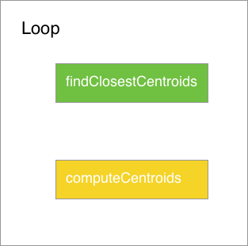
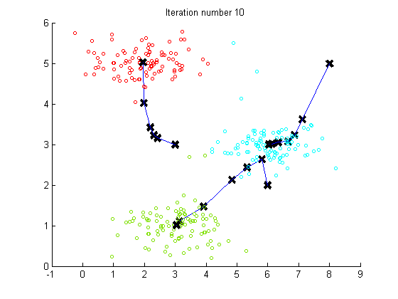

# 题目： K-Means 解题报告

本次作业为 `机器学习` 课程的第三次作业主要是和 K-Means 算法相关的课设和结题报告。

## 实现功能简介

针对作业中提供的训练集 `ex3data1.mat` 和 `ex3data2.mat` ，通过完成

// 待续

## 编写代码详述

在讨论具体的编码实现之中，我们可以对我们的程序文件进行逐个分析并简述功能和结果。在本部分之中我们会逐步分析 `ex3.m` 和 `ex3_pca.m` 两个文件中的各个 Part 去逐渐的完成这几个 Task 的功能，最终达到完成本次题目并且最终了解与逻辑回归相关知识的目的。

* 我们首先来分析 `ex3.m` 中的代码实现，来分析 K-Means 的具体实现：

``` matlab
%  To help you implement K-Means, we have divided the learning algorithm 
%  into two functions -- findClosestCentroids and computeCentroids.
```

程序中将 **K-Means** 算法分成了两个函数 **findClosestCentroids** 和 **computeCentroids** 函数，整个程序本身处于一个大的系统循环之中：




### Find Closest Centroids

``` matlab
% Find the closest centroids for the examples using the
% initial_centroids
idx = findClosestCentroids(X, initial_centroids);
```

我们在程序中调用 **findClosestCentroids.m** 文件，实现从给予的用例数据中，获取每个元素最近的中心。

对于每一个样例 $i$ ，计算其应该属于的类：
$$
c(i)  = j,min(||x^i −u_j||^2)
$$

``` matlab
for i=1:size(X,1)  
    adj = sqrt((X(i,:)-centroids(1,:))*(X(i,:)-centroids(1,:)));  
    idx(i)=1;  
    for j=2:K  
        temp=sqrt((X(i,:)-centroids(j,:))*(X(i,:)-centroids(j,:)));  
        if(temp<adj)  
            idx(i)=j;  
            adj=temp;  
        end  
    end 
end  
```

`centroids` 的输入是一个 **K** 个中心组成的特征向量，我们用变量 **idx** 记录离每个点最近的中心，这里我们的实现比较简单和暴力，这里我们通过一个简单的二次循环去比较找出最近的中心。


在这步中我们获得了如上的输出。

### Compute Means

``` matlab
%% ===================== Part 2: Compute Means =========================
%  After implementing the closest centroids function, you should now
%  complete the computeCentroids function.
%
fprintf('\nComputing centroids means.\n\n');

%  Compute means based on the closest centroids found in the previous part.
centroids = computeCentroids(X, idx, K);
```

接着我们来实现文本中的第二部分中的程序内容，在完成最近质心的计算之后需要完成质心的计算方法，我们调用 **computeCentroids** 部分的具体程序，并且传入了我们在上一步中计算出的一些计算结果：

``` matlab
for i=1:K
    list = find(idx==i);
    for j=1:size(list,1)
        centroids(i,:)=centroids(i,:)+X(list(j),:);
    end;
    centroids(i,:)=centroids(i,:)./size(list,1);
end;
```

 写成公式：

这里我们在里循环的每次迭代之后都计算了一个质点的均值，以便于在每次的迭代之后能更新出我们对应的质心的特征向量。

输出：


### K-Means Clustering

``` matlab
%% =================== Part 3: K-Means Clustering ======================
%  After you have completed the two functions computeCentroids and
%  findClosestCentroids, you have all the necessary pieces to run the
%  kMeans algorithm. In this part, you will run the K-Means algorithm on
%  the example dataset we have provided. 
%
```

在完成两个方法之后我们可以运行 **K-Means ** 算法了。



从这张图中我们能非常清晰的看出在10轮运算之中，质心在每一轮更新之后的状态。

* 接着我们在程序中引入 **Principal components analysis** 

**K-Means** 的优势十分明显，但是缺点也是令人一目了然的：

> * 聚类数目*k*是一个输入参数。选择不恰当的*k*值可能会导致糟糕的聚类结果。
> * 收敛到局部最优解，可能导致“反直观”的错误结果

K-Means 在引入大量数据的时候，可能会出现数据维度过高的情况出现，这种情况下，无论是分析我们的程序还是理解输出都为给我们造成很大的困扰。PCA 就是这样的一个用作 `降维` 的方法，PCA 不是一种经常使用的计算方法，因为降低维度本身是一种对数据的加工，如果我们没有

### Load Example Dataset


## 课程总结

精彩而又有趣的机器学习课程落下了帷幕，短短几周的课程让我们感到受益匪浅，我们不但学习了很多有用的理论知识，而且还学到了很多 ML 进行实践操作的技巧，这令我非常的满足和高兴。前一段时间参加了一个在线的 Hackathon 活动，我们在几个小时中开发了一个基于 ML 的小程序，我们参照了一些前辈的 Demo 和思路，分析 MIDI 的文件格式，并且通过一些学习框架提供的神经网络学习的功能，实现了自动生产风格相近的 MIDI 电子乐的功能，做了一部分有趣的风格歉意