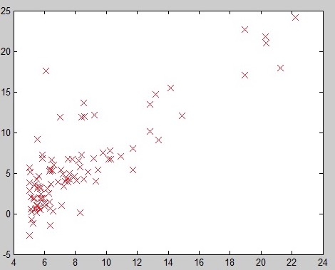
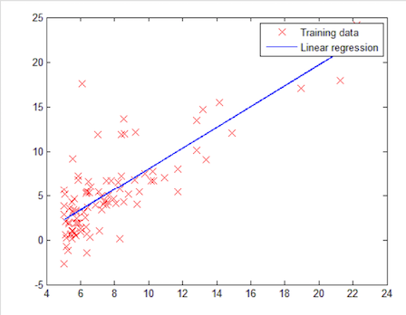
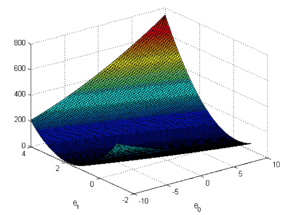
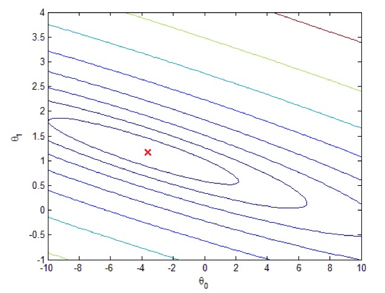
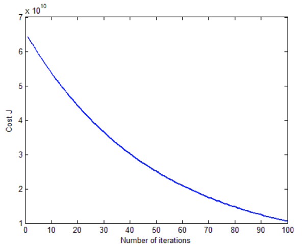

# 题目： 线性回归解题报告

此为本次作业 `机器学习` 的第一次作业有关线性回归算法的解题报告。

## 	实现功能简介

针对作业中提供的训练集 `ex1data1.txt` 和 `ex1data2.txt` （分别为单变量的训练集和多变量的训练集），另外从文档中可知训练集中的数据代表的是人口和利润，因而本次作业的实现功能就是通过使用这两个训练集分别通过单变量线性回归和多变量线性回归预测城市人口和利润之间的具体关系，并最后预测一个具体房子的价格。

## 	编写代码详述

在讨论具体的编码实现之中，我们可以对我们的程序文件进行逐个分析并简述功能和结果。

### 单变量线性回归

#### 训练集

 `ex1data1.txt`、 `ex1data2.txt` 为程序的训练集，分别针对单量和多变量。

#### 提供功能和绘制

`ex1.m`、`ex1_multi.m` 两个文件中包含本作业的测试题，根据提示不需要修改。

根据提示我们需要修改 `plotData.m` 中的方法对结果进行绘制（Note: You have to complete the code in plotData.m）：

``` matlab
figure; % open a new figure window
% Plot the message on screen
plot(x, y, 'rx', 'MarkerSize', 10);         
% y-axis-text
% ylabel('$10,000s Profit');              
% x-axis-text
% xlabel('10,000s Population of City');
```

我们执行 `plot` 函数进行画图，然后分别设置 `x轴` 和 `y轴` 的提示文字。

完成绘制之后我们可以完成  `ploting` 这个 Task :



画出来的图形如上图所示，在添加梯度下降部分的代码之后这张图还会**更新**。

#### 代价函数

在计算梯度下降的部分有着这样的代码：

``` matlab
X = [ones(m, 1), data(:,1)]; % Add a column of ones to x 给 X 左边添加一列
theta = zeros(2, 1); % initialize fitting parameters

% Some gradient descent settings
iterations = 1500;
alpha = 0.01;

% compute and display initial cost
computeCost(X, y, theta)
...
```

首行给 $ X $ 轴添加了最左侧的一列，代表 $ X_0 $ 列，之后初始化一些计算梯度的参数和设置，我们调用了 `computeCost(x, y, theta)` 这个方法，这个方法来自于 `computeCost.m`  文件，是用来计算梯度的代价，也是我们需要进行计算的部分。

根据我们已经学过的代价计算公式：

$$ J(\theta_0, \theta_1) = \frac{1}{2m} \sum_{i=0}^{m} (h(x^{(i)}) – y^{(i)})^2 $$ 其中 $$ h(x) = \theta^{T} x $$ 

我们应该先求出 $ h(x) = x * theta $ ，之后表示出每个 $$ ( (h(x^{(i)}) – y^{(i)})^2) $$ ：

``` matlab
(h(x) – y).^2  
```

上面的向量所有元素加起来就是累加结果：

``` matlab
sum((h(x) – y).^2)
```

我们在此处添加如下代码：

``` matlab
J = 1 / (2*m) * sum(((X * theta - y).^2));
```

最后全部的代价计算方法应该写做如下：

``` matlab
function J = computeCost(X, y, theta)
%COMPUTECOST Compute cost for linear regression
%   J = COMPUTECOST(X, y, theta) computes the cost of using theta as the
%   parameter for linear regression to fit the data points in X and y

% Initialize some useful values
m = length(y); % number of training examples

% You need to return the following variables correctly 
J = 0;
% ====================== YOUR CODE HERE ======================
% Instructions: Compute the cost of a particular choice of theta
%               You should set J to the cost.

J = 1 / (2*m) * sum(((X * theta - y).^2));

% =========================================================================
end
```

#### 梯度下降计算

在 `Part 2: Gradient descent` 中，在计算代价之后，我们调用了计算数据的梯度方法：

``` matlab
% run gradient descent
theta = gradientDescent(X, y, theta, alpha, iterations);
```

我们要在 `gradientDescent.m`  方法中去实现具体的计算梯度的方法，根据梯度的计算公式：

$$\theta_j := \theta_j -\alpha \frac{1}{m} \sum_{i=0}^{m} \left( (h(x^{(i)}) – y^{(i)}) \cdot x_j\right)$$

在这里面我们试着对每个参数进行遍历求值，我们先去表现出每个参数的子部分：

``` matlab
% 第j个参数对应的是
(X * theta – y) .* X(:, j)
```

还有就是第 J 个参数的计算方式，更新计算方法：

``` matlab
theta = theta - alpha * (X' * (X * theta - y)) / m;  
```

最后梯度部分的计算方式的全部代码如下：

```matlab
function [theta, J_history] = gradientDescent(X, y, theta, alpha, num_iters)  
    %GRADIENTDESCENT Performs gradient descent to learn theta  
    %   theta = GRADIENTDESENT(X, y, theta, alpha, num_iters) updates theta by   
    %   taking num_iters gradient steps with learning rate alpha  
      
    % Initialize some useful values  
    m = length(y); % number of training examples  
    J_history = zeros(num_iters, 1);  
      
    for iter = 1:num_iters  
      
        % ====================== YOUR CODE HERE ======================  
        % Instructions: Perform a single gradient step on the parameter vector  
        %               theta.   
        %  
        % Hint: While debugging, it can be useful to print out the values  
        %       of the cost function (computeCost) and gradient here.  
        %  
        % ============================================================  
      
        % Save the cost J in every iteration      
        theta = theta - alpha * (X' * (X * theta - y)) / m;  
        J_history(iter) = computeCost(X, y, theta);
    end
    end  
```

#### 结果

单变量线性回归的拟合函数的运行结果是：



预测结果为：

``` matlab
ans = 32.0727
Theta found by gradient discent: -3.630291 1.166362
For population = 35,000, we predict a profit of 4519.767868
For population = 70,000, we predict a profit of 45342.450129
```

根据 `Visualizing J` 中的实现代码，我们通过 **computeCost** 函数，我们计算出对应的值并储存到一个以 theta0 和 theta1 为坐标的矩阵 **J_vals** 中通过使用 **surf** 和 **contour** 命令，我们可以构建出图形：



 $ f(\theta) $ 的等高线如下：



### 多变量线性回归

####训练集

多变量的线性使用的训练集是 `ex1data2.txt` 。

#### 特征缩放

通过分析 `ex1_multi.m` 中的 `Part 1: Feature Normalization` 部分的代码，我们需要实现体征缩放部分的代码：

``` matlab
% Scale features and set them to zero mean
fprintf('Normalizing Features ...\n');

[X, mu, sigma] = featureNormalize(X);

% Add intercept term to X
X = [ones(m, 1) X];
```

特征缩放部分的公式是

$$x_n = \frac{x_n – \mu_n}{s_n}$$

但是缩放之后在预测新的输入新的参数的时候也要做出相同的参数，所以我们在求出每列的均值（mean）和标准差（std），之后可以对每行进行缩放。

``` matlab
for i = 1 : size(X,2)
    mu(i) = mean(X(:,i));
    sigma(i) = std(X(:,i));
    X_norm(:,i) = (X(:,i) - mu(i)) / sigma(i);
end
```

最终我们特征缩放的全部方法代码如下：

``` matlab
function [X_norm, mu, sigma] = featureNormalize(X)
%FEATURENORMALIZE Normalizes the features in X 
%   FEATURENORMALIZE(X) returns a normalized version of X where
%   the mean value of each feature is 0 and the standard deviation
%   is 1. This is often a good preprocessing step to do when
%   working with learning algorithms.

% You need to set these values correctly
X_norm = X;
mu = zeros(1, size(X, 2));
sigma = zeros(1, size(X, 2));
% ====================== YOUR CODE HERE ======================
% Instructions: First, for each feature dimension, compute the mean
%               of the feature and subtract it from the dataset,
%               storing the mean value in mu. Next, compute the 
%               standard deviation of each feature and divide
%               each feature by it's standard deviation, storing
%               the standard deviation in sigma. 
%
%               Note that X is a matrix where each column is a 
%               feature and each row is an example. You need 
%               to perform the normalization separately for 
%               each feature. 
%
% Hint: You might find the 'mean' and 'std' functions useful.
%       
for i = 1 : size(X,2)
    mu(i) = mean(X(:,i));
    sigma(i) = std(X(:,i));
    X_norm(:,i) = (X(:,i) - mu(i)) / sigma(i);
end
% ============================================================
end
```

#### 代价函数和梯度下降计算

分析 `ex1_multi.m` 部分的代码 `Part 2: Gradient Descent` 的代码，我们要在 `computeCostMulti.m` 和 `gradientDescentMulti.m` 文件之中分别去实现代价函数和梯度计算部分的代码。

我们在多变量计算中使用的具体方法，本质上和单变量中我们具体实现的计算方法没有什么区别，唯一区别就是矩阵 **X** 的特性不止一个，我们可以使用 `size(X, 2)` 找出训练组中有多少特性。

* 代价函数

``` matlab
function J = computeCostMulti(X, y, theta)
%COMPUTECOSTMULTI Compute cost for linear regression with multiple variables
%   J = COMPUTECOSTMULTI(X, y, theta) computes the cost of using theta as the
%   parameter for linear regression to fit the data points in X and y
% Initialize some useful values
m = length(y); % number of training examples
% You need to return the following variables correctly 
J = 0;
% ====================== YOUR CODE HERE ======================
% Instructions: Compute the cost of a particular choice of theta
%               You should set J to the cost.
J = 1 / (2*m) * sum(((X * theta - y).^2));
% =========================================================================
end
```

* 梯度下降函数

``` matlab
function [theta, J_history] = gradientDescentMulti(X, y, theta, alpha, num_iters)
%GRADIENTDESCENTMULTI Performs gradient descent to learn theta
%   theta = GRADIENTDESCENTMULTI(x, y, theta, alpha, num_iters) updates theta by
%   taking num_iters gradient steps with learning rate alpha
% Initialize some useful values
m = length(y); % number of training examples
J_history = zeros(num_iters, 1);
for iter = 1:num_iters
    % ====================== YOUR CODE HERE ======================
    % Instructions: Perform a single gradient step on the parameter vector
    %               theta. 
    %
    % Hint: While debugging, it can be useful to print out the values
    %       of the cost function (computeCostMulti) and gradient here.
    %
     tempTheta = theta; %save the theta from last iteration
     % Update for thetass
     for i = 1 : size(X,2)
         theta(i) = tempTheta(i) - alpha / m * sum((X * tempTheta - y) .* X(:,i));
     end
    % ============================================================
    % Save the cost J in every iteration    
    J_history(iter) = computeCostMulti(X, y, theta);
end
end
```

#### 普通等式

根据 `Part 3: Normal Equations` 我们需要实现 `normalEqn.m` 中的计算公式。

根据 `Normal Equation` 的计算公式：

$$\theta = (x^Tx)^{-1} x^T y$$

可以实现代码为：

``` matlab
theta = (X' * X) \ X' * y;
```

最后全部的 `normalEqn.m` 的实现代码为：

``` matlab
function [theta] = normalEqn(X, y)
%NORMALEQN Computes the closed-form solution to linear regression 
%   NORMALEQN(X,y) computes the closed-form solution to linear 
%   regression using the normal equations.
theta = zeros(size(X, 2), 1);
% ====================== YOUR CODE HERE ======================
% Instructions: Complete the code to compute the closed form solution
%               to linear regression and put the result in theta.
%
% ---------------------- Sample Solution ----------------------
theta = (X' * X) \ X' * y;
% -------------------------------------------------------------
% ============================================================
end
```

#### 预测房价

根据 `ex1_multi.m` 中的 `Part 3: Normal Equations` 的部分的代码：

``` matlab
% Estimate the price of a 1650 sq-ft, 3 br house
% ====================== YOUR CODE HERE ======================
price = 0; % You should change this
% ============================================================
fprintf(['Predicted price of a 1650 sq-ft, 3 br house ' ...
         '(using normal equations):\n $%f\n'], price);
```

我们需要去预测一个 `1650 sq-ft 3br` 房子的具体价格。

参照前文的描述，我们在 `ex1_multi.m` 中添加如下代码：

``` matlab
% Estimate the price of a 1650 sq-ft, 3 br house
 % ====================== YOUR CODE HERE ======================
 % Recall that the first column of X is all-ones. Thus, it does
 % not need to be normalized.
te = [1650 3];
te = te - mu;
te = te ./ sigma;

price = [1 te] * theta; % You should change this

% 正规式方程的具体部分
% Estimate the price of a 1650 sq-ft, 3 br house
 % ====================== YOUR CODE HERE ======================
price = [1 1650 3] * theta; % You should change this
```

 #### 结果

* 多变量 $J(\theta) $ 的拟合结果：

  


* 多变量的输出结果

```matlab
Theta computed from gradient descent: 
       340412.7 
       110631.1
       -6649.474
Predicted price of a 1650 sq-ft, 3 br house (using gradient descent):
	   293081.5

Theta computed from gradient descent: 
      89597.9095
      139.2107
      -8738.0191
Predicted price of a 1650 sq-ft, 3 br house (using gradient descent):
	   293081.5
```

## 总结

本次作业中我主要接触了数据拟合、线性回归分析和代价计算、梯度下降等方面的具体知识，让我感到受益匪浅，获得了很多和机器学习相关的具体知识之外，我们从老师的课中还学到了很多科学的研究方法和学习方法。学到的这些研究和学习方法，会对我们之后无论是学习生活还是科研生活都有很多助益。

在这门课之中带领我们真正达到了学以致用、知行合一的状态，比如在这次作业之中我们使用了很多拟合数据的方法，还有梯度的计算方法，这些都是我们在大一的高等数学中的知识，这些知识当时学起来的时候是干瘪而又没有应用性的，但是通过机器学习这门课，我们把已经放下很久的知识又重新的用上了，干枯乏味的知识在这门课里又被赋予了鲜活的生命。

机器学习是近来研究的一个比较热门的项目，学校能提供这样的一堂课的机会让我们接触这种比较前沿和先进的知识，让我感到非常的棒。虽然只是以一种导论课、入门课的方式的去让我们去领略机器学习这个研究方向的精彩和有趣，但学到的知识已经让我们感到非常的有趣和满足了。

我个人比较感性的方向是和 PLT 相关的方向，多是和编程语言的发展、设计、证明相关的知识，平时在这方面的实践仅限于一些编译器、解释器的构造，学习和编写和 Machine-Learning 相关的代码让我学到了很多和往常接触的不一样的知识，令人大开眼界，感谢老师的授课，希望在今后的课堂上学到更多有趣的知识。